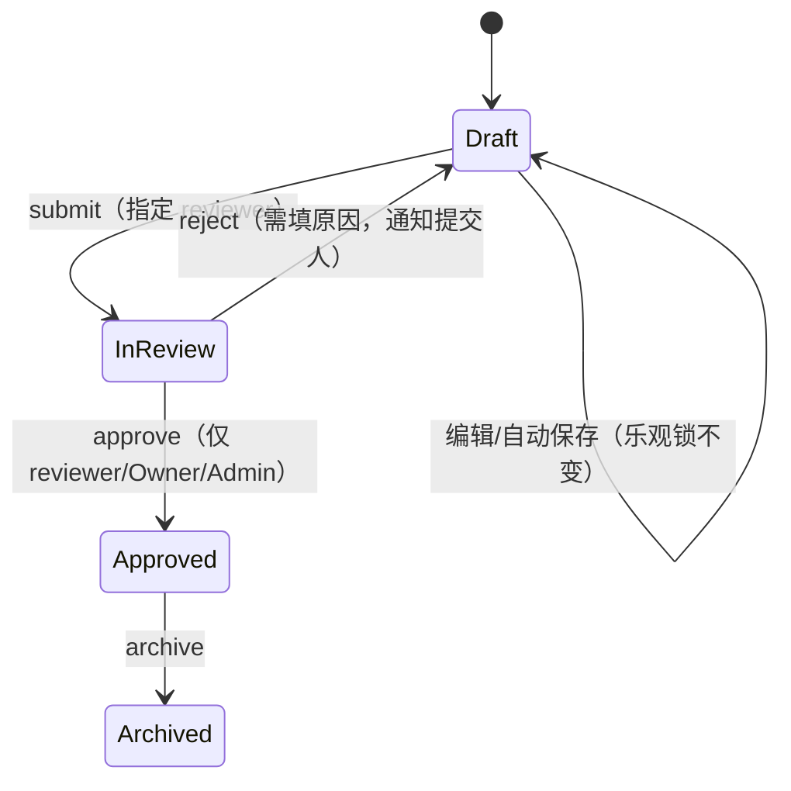

# ELN 专业化改造 — 评审报告与实施计划

## 一、现状总览

**已建成的能力**（成熟度较高）：
- 后端：22 张表、RBAC（`resource:action` + 通配符）、乐观锁 + 版本快照、7 类电池数据 ETL（含冲突检测/覆盖合并）、电芯分组（前缀匹配+手动）—— 这套 ETL+分组设计相当优雅，是本项目最强的部分。
- 前端：React 19 + Tailwind 4，7 种图表可视化、i18n 中英文覆盖 ~95%、组件库（Modal/Drawer/Toast/StepProgress）风格统一。

**关键发现 —— 几个"半成品钩子"**（值得注意，是低成本高价值的切入点）：
1. `ExperimentStatus` 枚举（packages/shared/src/enums.ts）定义了 `Draft/InReview/Approved/Archived` 四态，ProjectDetail.tsx（apps/frontend/src/pages/ProjectDetail.tsx#L365-L378）已经画好了 "Approved" 绿色徽章的渲染逻辑 —— 但后端 experiments.service.ts（apps/backend/src/experiments/experiments.service.ts）只实现了 `submit()`（Draft→In Review），**审批/拒绝/归档完全没有入口**，Approved 是一个视觉上存在但逻辑上不可达的死状态。
2. `Attachment` 实体（apps/backend/src/entities/attachment.entity.ts）被 `findDetail()` 查询、被 `remove()` 级联删除，但**全仓库没有任何上传/下载/删除附件的接口**，前端也零 UI —— 是个完全没有写入路径的哑表。
3. `ExperimentCollaborator` 实体有 `role` 字段，但从未被前端展示、也从未参与实际鉴权判断 —— 协作者数据存在但"隐形"。
4. 前端导出按钮（`export_summary_data`/`export_raw_data`）UI 已存在但 handler 未接通。
5. 登录后落地页是 `/projects` 列表，**没有 Dashboard/首页**，无跨项目 KPI、无活动流。
6. 无通知表、无评论表、无审计日志表；package.json 确认无 nodemailer/socket.io/bullmq —— 通知系统要从零建。

这些发现说明产品在设计阶段（BACKEND_SPEC.md）就已经规划了完整的审批闭环和协作能力，但实现时优先做了 ETL 数据管道这个"硬骨头"，评审/协作层被搁置了。

---

## 二、建设性意见

### 1. 功能层面

| 建议 | 现状问题 | 说明 |
|---|---|---|
| **补全审批工作流** | Approved/Archived 状态不可达 | 新增 `approve` / `reject` / `archive` 端点 + 状态机校验，指定 reviewer，拒绝需填原因 |
| **协作者管理** | 数据存在但无 UI、不参与鉴权 | 实验详情页加"协作者"面板，可添加/移除，为后续 reviewer 指派打基础 |
| **附件上传/下载** | 完全无写入路径 | 复用 `data.controller.ts` 里已有的 `FileInterceptor` 模式，实现真正的文件留存（原始报告、佐证材料） |
| **评论/讨论** | 无 | 实验维度的评论区，评审时可留痕沟通，替代线下微信/邮件讨论 |
| **站内通知** | 无基建 | 提交/批准/拒绝/评论时通知相关人；轻量轮询即可，不必上 WebSocket |
| **版本历史可视化** | 后端有完整 JSON 快照，前端零展示 | 复用已有数据，加一个"版本历史"侧栏 + 简单 diff（字段级对比） |
| **仪表盘/数据洞察** | 无 | 首页展示：待我审批、我的实验、最近活动、项目/实验状态分布 |

### 2. 设计（信息架构）层面

- **导航结构**：在 Layout.tsx（apps/frontend/src/components/Layout.tsx）的 `NAVIGATION` 顶部加入 "Dashboard"，作为登录后新的默认落地页（而非直接进 `/projects`）。
- **头部通知铃铛**：复用现有 `Toast` 的视觉语言，加一个未读计数小红点 + 下拉列表。
- **实验详情页 Tab 化**：目前 `ExperimentDetail.tsx` 是一个长页面，建议拆分为 Tab（笔记 / 数据 / 附件 / 协作者 / 版本历史 / 评论），复用现有 `StepProgress`/`Drawer` 的组件语言，避免页面越堆越长。
- **状态色彩系统**：Draft(灰) / In Review(黄) / Approved(绿) 已有，补齐 Rejected(红) / Archived(灰蓝) 保持一致性。

### 3. 页面层面

- 新增 **Dashboard.tsx**（`/dashboard`，设为登录后默认路由）
- **ExperimentDetail.tsx** 改造为 Tab 布局，新增"协作者""附件""版本历史""评论"四个子面板
- 新增**通知下拉**（挂在 Layout Header，非独立页面即可满足 MVP）
- Roles 页面需要为新增权限点（`experiments:approve` 等）补充配置项

### 4. 流程层面

关键设计点：
- 审批权限用**新权限点** `experiments:approve`：验证过种子角色数据（apps/backend/src/seed.ts），Owner/Admin 已有 `experiments:*` 通配符会自动获得该权限，Editor/Viewer 自动被排除 —— **不需要改任何种子数据**就能实现"提交人不能自批"的合理默认。
- 拒绝需要打回 Draft 并强制填写原因，原因写入 `versionHistory.changeSummary`，避免重新发明一张表。
- 通知触发点：submit / approve / reject / 新增评论 —— 这四个事件是最小可行集合。

---

## 三、下一步实施计划

**TL;DR**：分四个阶段推进，Phase 1（审批工作流闭环 + 协作者管理基础）是性价比最高的起点 —— 复用现成的 `ExperimentStatus` 枚举、现成的权限通配符机制、现成的 `versionHistory` 快照表，改动集中在 experiments 模块，前后端加起来工作量可控，且直接盘活了前端已经画好的 "Approved" 死状态。后续阶段依次解锁协作沟通、仪表盘洞察、体验打磨。

### Phase 1 — 评审工作流闭环 + 协作者管理（详细，可直接执行）

1. **后端状态机**（*可与步骤2并行*）：在 experiments.service.ts（apps/backend/src/experiments/experiments.service.ts）新增 `approve()` / `reject()` / `archive()` 方法，仿照现有 `submit()` 的模式（乐观锁校验 + versionNo 递增 + versionHistory 快照写入）。新增 `ALLOWED_TRANSITIONS` 映射表做状态跳转合法性校验（如禁止 Draft 直接到 Approved）。`reject()` 强制要求 `reason` 参数，写入 `changeSummary`。
2. **Experiment 实体扩展**（*依赖步骤1的设计*）：新增可空字段 `reviewerId`（指定审核人）、`reviewComment`（最近一次审批意见）、`reviewedAt`。生成新 migration（`pnpm --filter @eln/backend run typeorm:generate`）。
3. **新增权限点**：`experiments:approve`、`experiments:archive`，在 experiments.controller.ts（apps/backend/src/experiments/experiments.controller.ts）对应端点用 `@RequirePermission()` 装饰器标注。**不改种子数据**（已确认 Owner/Admin 通配符自动覆盖）。
4. **协作者管理 API**（*可与步骤1并行*）：`ExperimentCollaborator` 已有实体，补充 CRUD 端点（`GET/POST/DELETE /experiments/:id/collaborators`），为步骤5的 reviewer 指定下拉框提供数据源。
5. **前端 — 审批 UI**（*依赖步骤1-3*）：ExperimentDetail.tsx（apps/frontend/src/pages/ExperimentDetail.tsx）增加"提交审核"（可选 reviewer 下拉，数据来自步骤4）、"批准"/"拒绝"（`canWrite`+`experiments:approve` 权限双重判断，参照现有 `canWrite` 模式）按钮，拒绝需要弹窗填原因（复用 `Modal.tsx`）。
6. **前端 — 状态徽章补全**（*依赖步骤1*）：ProjectDetail.tsx（apps/frontend/src/pages/ProjectDetail.tsx）补充 `Rejected`/`Archived` 徽章样式，与现有 Draft/InReview/Approved 三色保持一致的设计语言。
7. **前端 — 协作者面板**（*依赖步骤4*）：`ExperimentDetail.tsx` 新增协作者列表 + 添加/移除 UI，复用 `Drawer.tsx` 或就地面板。
8. **Roles 页面同步**（*依赖步骤3*）：Roles.tsx（apps/frontend/src/pages/Roles.tsx）权限矩阵里补充 `experiments:approve`/`experiments:archive` 两行，让 Admin 可以按需调整给别的角色。

**Phase 1 相关文件**：
- `apps/backend/src/experiments/experiments.service.ts` — 新增 approve/reject/archive 方法
- `apps/backend/src/experiments/experiments.controller.ts` — 新增端点 + 权限装饰器
- `apps/backend/src/entities/experiment.entity.ts` — 新增 reviewerId/reviewComment/reviewedAt 列
- `apps/backend/src/migrations/` — 新 migration
- `packages/shared/src/enums.ts` — 如需新增 Rejected 状态（见下方 Further Considerations）
- `apps/frontend/src/pages/ExperimentDetail.tsx` — 审批按钮 + 协作者面板
- `apps/frontend/src/pages/ProjectDetail.tsx` — 状态徽章补全
- `apps/frontend/src/pages/Roles.tsx` — 权限矩阵补充

**Phase 1 验证**：
1. 单元测试：仿照现有 `experiments/__tests__/` 补 approve/reject/archive 的状态跳转合法性测试（含非法跳转应抛错）
2. e2e：扩展 `apps/backend/test/eln-flow.e2e-spec.ts`，走完 submit→approve 全流程
3. 手动验证：`requests.http` 补充对应请求，用 Editor 账号验证无法调用 approve（403），用 Owner 账号验证可以

### Phase 2 — 协作与沟通深化（*依赖 Phase 1 的协作者面板*）

- 附件上传/下载：复用 `data.controller.ts` 的 `FileInterceptor` 模式，新增 `POST/GET/DELETE /experiments/:id/attachments`
- 评论功能：新增 `ExperimentComment` 实体（experimentId, userId, content, createdAt），前端加评论区（可复用 `Drawer`）
- 站内通知：新增 `Notification` 实体（userId, type, payload, relatedExperimentId, isRead），触发点 = submit/approve/reject/评论；前端 Header 加通知铃铛，轮询 `GET /notifications/unread-count`

### Phase 3 — 仪表盘与数据洞察（*依赖 Phase 1/2 产出的活动数据*）

- 后端新增 `GET /api/v1/dashboard/summary`：项目/实验状态分布、待我审批列表、最近活动（合并 versionHistory + comment + notification）
- 前端新增 `Dashboard.tsx`，设为登录后默认路由，Layout.tsx（apps/frontend/src/components/Layout.tsx）导航加入入口

### Phase 4 — 前端体验打磨（*可独立于 Phase 2/3 并行推进*）

- 版本历史 diff 查看器（复用已有 `versionHistory.snapshot` JSON，字段级对比即可，不需要引入专门的 diff 库）
- 笔记编辑器从 `<textarea>` 升级为轻量 Markdown 编辑器（预览+源码双栏，避免引入过重的富文本框架）
- 导出功能真正接通（Excel/PDF，优先 Excel 因为已有 `exceljs` 依赖）
- 全局搜索（跨项目/实验的简单关键词检索）

---

## 决策与假设

- **定位**：内部研发工具，因此不做电子签名、21 CFR Part 11、多租户隔离（用户已明确排除）
- **通知机制**：站内 DB 轮询，不引入邮件/WebSocket 基建（当前无相关依赖，避免过度设计）
- **审批权限**：复用现有 `resource:action` 通配符机制，新增权限点而非重新设计权限模型

## 需要确认的问题

1. **Reviewer 指定方式**：方案 A（推荐）— 在 `Experiment` 上加单一 `reviewerId` 字段，简单直接；方案 B — 复用 `ExperimentCollaborator.role` 标记某协作者为 Reviewer，支持多审核人但改造面更大。先做 A，未来有需要再扩展到 B？
2. **是否需要新增 `Rejected` 状态**，还是"拒绝"直接打回 `Draft` 并在 `versionHistory` 里留痕即可（更轻量，不用改枚举/迁移）？倾向后者。
3. **Phase 2 的评论功能范围**：只做实验维度的扁平评论列表，还是需要针对某一行数据/某个图表的定点评论（更复杂）？建议先扁平列表。
</content>
